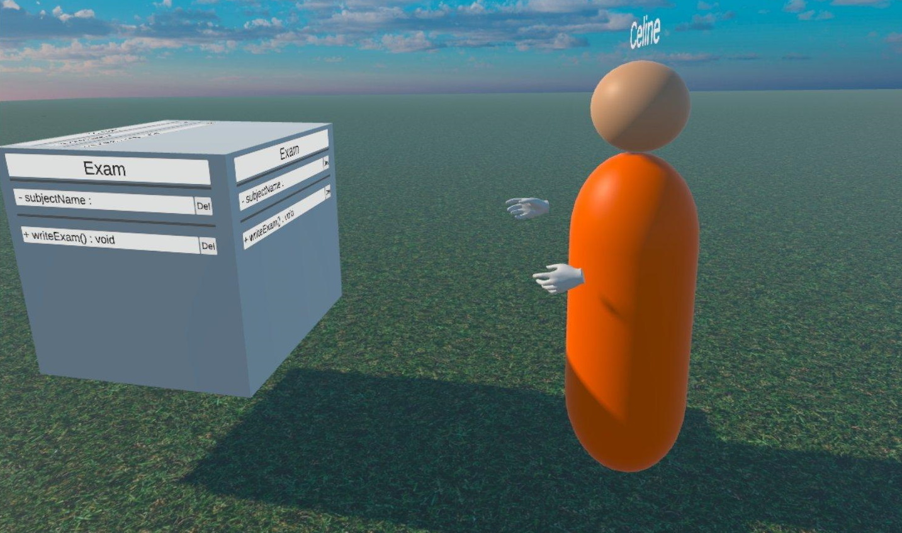

Modeling is a key activity in conceptual design and system design. Through collaborative modeling, end-users, stakeholders, experts, and entrepreneurs are able to create a shared understanding of a system representation. While the Unified Modeling Language (UML) is one of the major conceptual modeling languages in object-oriented software engineering, more and more concerns arise from the modeling quality of UML and its tool-support. Among them, the limitation of the two-dimensional presentation of its notations and lack of natural collaborative modeling tools are reported to be significant. In this paper, we explore the potential of using Virtual Reality (VR) technology for collaborative UML software design by comparing it with classical collaborative software design using conventional devices (Desktop PC / Laptop). For this purpose, we have developed a VR modeling environment that offers a natural collaborative modeling experience for UML Class Diagrams. Based on a user study with 24 participants, we have compared collaborative VR modeling with conventional modeling with regard to efficiency, effectiveness, and user satisfaction. Results show that the use of VR has some disadvantages concerning efficiency and effectiveness, but the user’s fun, the feeling of being in the same room with a remote collaborator, and the naturalness of collaboration were increased.

