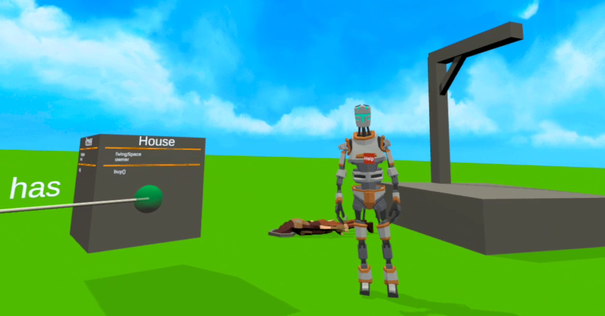



Modeling is a key activity in conceptual design and system design which makes learning and understanding modeling languages like the Unified Modeling Language (UML) important. Many interactive UML learning applications exist and also gamification-based alternatives have been proposed in recent years to promote the engagement of learners. However, none of the existing approaches provide an immersive learning environment that can be used to increase interactivity while learning. As a consequence, existing UML learning applications cannot create a feeling of presence that can positively influence learning outcomes, and the potential of gamification is not fully exploited. To overcome this problem, in this demo paper, we present an immersive gamification-based UML learning environment in Virtual Reality (VR) to practice modeling class diagrams in an interactive way. The VR environment provides minigames and multi-viewpoint modeling features to learn creating class diagrams. The multi-viewpoint component highlights correspondences between a class diagram and a 3D model of an example system. The goal of this approach is to improve the learners' motivation, make the learning process an enjoyable experience, and boost learning outcomes.

